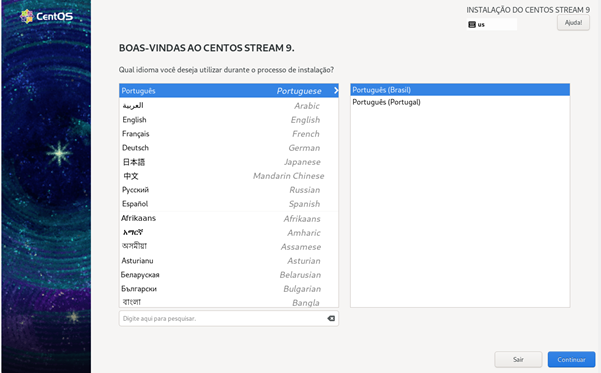
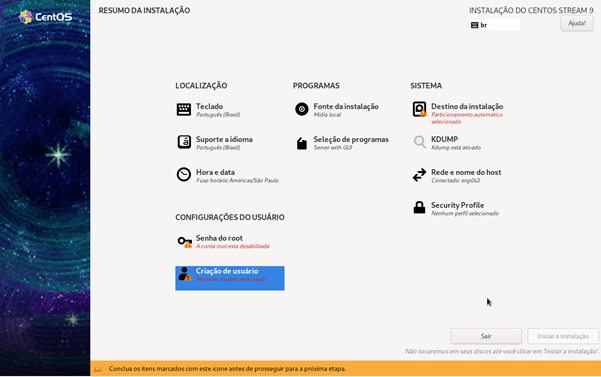
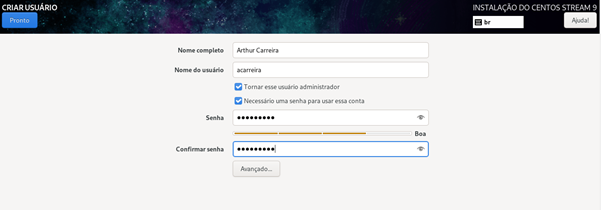
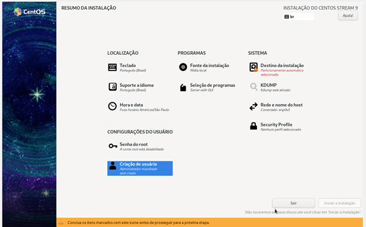
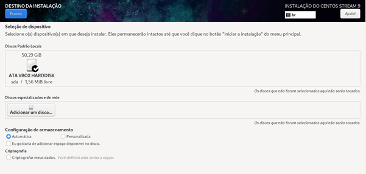
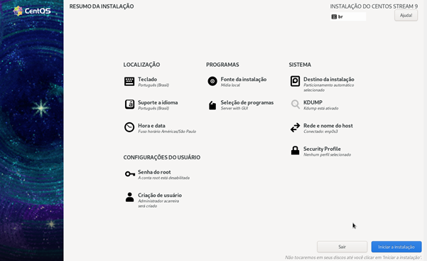
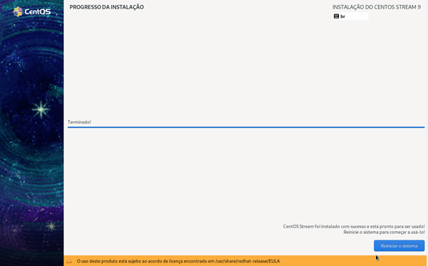
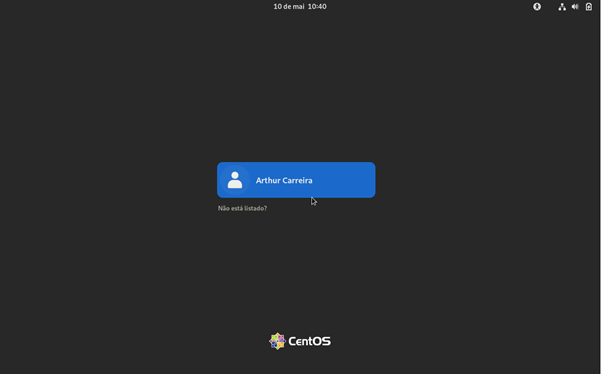
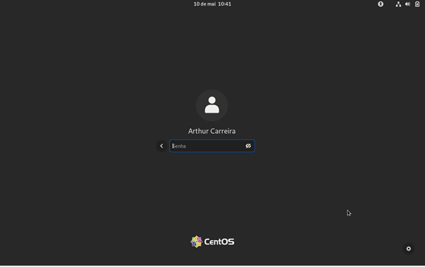

# MANUAL DE INSTRUÇÔES DO SISTEMA OPERACIONAL CENTOS
Nesse repositório iremos mostrar pra vocês como instalar o sistema operacional CENTOS no computador! Segue abaixo as intruções:

01) ESCOLHA O SEU IDIOMA DE PREFERÊNCIA E APERTE EM ”CONTINUAR”. 

02) APERTE EM ”CRIAÇÃO DE USUÁRIO”.

03) PREENCHA AS INFORMAÇÕES, ATIVE O BOTÃO” TORNAR ESSE USUÁRIO ADMINISTRADOR” E APERTE PRONTO.

04) APERTE EM ”DESTINO DA INSTALAÇÃO”.

05) NÃO MEXA EM NADA E APERTE NO ”PRONTO”.

06) APÓS AS ETAPAS APERTE EM ”INICIAR INSTALAÇÃO”.

07) AGUARDE CARREGAR, APÓS TERMINAR CLIQUE EM” REINICIAR O SISTEMA”

08) CLIQUE NO USUÁRIO QUE VOCÊ QUER ENTRAR.

09) COLOQUE A SENHA QUE VOCÊ CRIOU NA CRIAÇÃO DE USUARIO E APERTE ”ENTER”

10) SUA INSTALAÇÃO ESTA CONCLUIDA.

